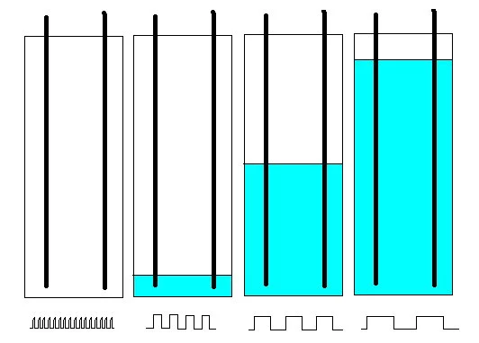
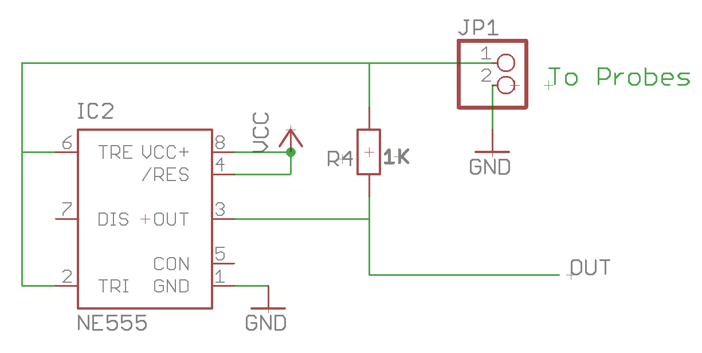
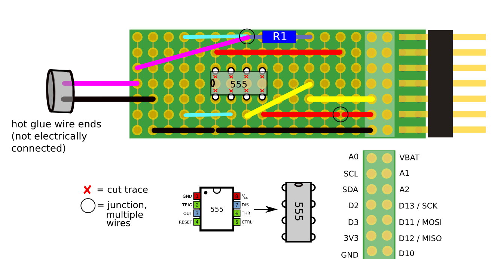

# Turbidity sensor prototype

## Background

There are various approaches [1] to depth measurement -- float switches, arrays of open wires, optical and sonar distance sensors, etc.  One simple approach is to leverage the dielectric properties of water by making a capacitive measurement.  

The simple picture is: a capacitor's ability to store electrical energy is enhanced when it is placed in a material with a larger dielectric constant.  Water has a larger dielectric constant than air;  so capacitors placed in water can store more energy than they can when in air.  For a capacitor formed by a long pair of wires, partially submerged in liquid, the measured capacitance of the wires will increase in proportion to the length of the wires submerged in the liquid.  So, measuring the capacitance of these wires would allow us to determine the height of the liquid.

A simple way to measure capacitance is to rely on the fact that the amount of time it takes to charge and discharge a capacitor, when applying a fixed voltage, will increase as the capacitance increases.  A chip like the [555 timer](REF) performs exactly this function:  it will charge a capacitor to a threshold voltage, then discharge it, then repeat the cycle, outputting a pulse every time the capacitor charges to a threshold value.  If we hook up a long pair of wires as a capacitor to a 555, and measure the length of time between pulses, we then have a simple liquid level sensor:

_Source: http://www.digikey.com/en/articles/techzone/2011/sep/liquid-level-sensing-is-key-technology-for-todays-systems---part-1_

## Circuit

## Bill of Materials

## Schematic 

## Diagram for Riffle Protoboard

## Calibration Methods

## Research Notes on Public Lab

## References

1. Digikey's guide to depth measurement techniques: http://www.digikey.com/en/articles/techzone/2011/sep/liquid-level-sensing-is-key-technology-for-todays-systems---part-1
2. Using light sensors and a ping pong ball: http://howmuchsnow.com/waterlevel/
e

------

Links to research on capacitive sensors -- thread with dan beavers
Link to Scott Eustis research note https://publiclab.org/notes/eustatic/05-21-2016/riffing-on-the-riffle-for-a-depth-sensor-update-from-2014
Evaluation material
Ways of calibrating
Dan Beaver’s alternative proposal: https://publiclab.org/notes/danbeavers/05-18-2016/depth-sensor-proposal
Depth sensor workshop in NOLA
https://publiclab.org/notes/stevie/06-06-2016/reflecting-on-the-depth-sensor-build
https://publiclab.org/wiki/depth-flood-sensing-in-new-orleans
https://publiclab.org/notes/stevie/05-04-2016/depth-sensor-build
Original workshop: https://publiclab.org/notes/laurenrae/11-24-2014/don-explains-the-theory-behind-the-depth-sensor-for-the-riffle
Nice explanation of principle: http://njhurst.com/electronics/watersensor/
Vegetronix: https://www.vegetronix.com/Products/AquaPlumb/
REALLY good review of issues w/ capacitive depth sensor: http://www.umbc.edu/cuere/BaltimoreWTB/pdf/TM_2009_003.pdf
** grab page 21 bottom figure **
Issues w/ capacitive depth sensors: http://www.lionprecision.com/tech-library/technotes/cap-0020-sensor-theory.html
Various approaches to measuring depth: 
Github repo
Schematic
Protoboard layout
Code
Basic concept
Markdown doc → research note
History & Motivation
Road Salt
Flooding
Drought
Basic approaches
http://www.digikey.com/en/articles/techzone/2011/sep/liquid-level-sensing-is-key-technology-for-todays-systems---part-1
Optical, with ping pong ball: 
555 approach & history

